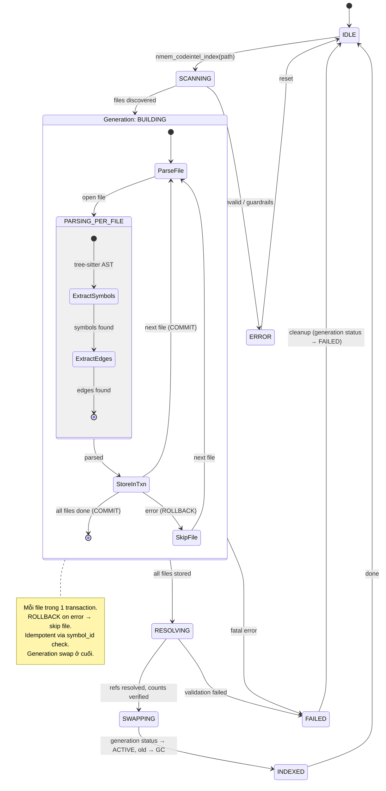
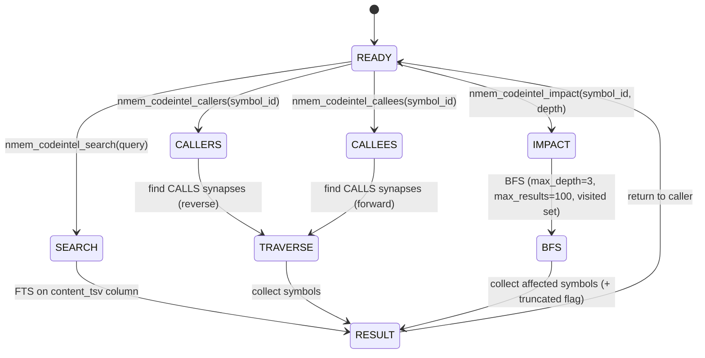
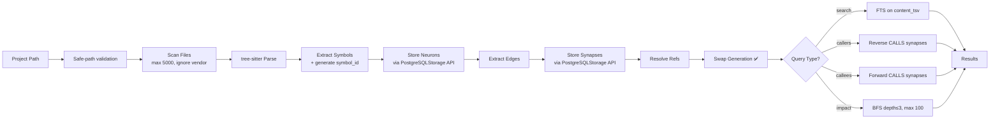

# 🧬 CodeIntel — Code Intelligence cho Neural Memory

> Tích hợp AST-based code intelligence (inspired by CodeGraph) vào Neural Memory,
> lưu trực tiếp vào **PostgreSQL brain** qua `supabrain_mcp.py` wrapper.

> [!IMPORTANT]
> **Reviewed by Dual-Agent Debate** (Codex + Claude Code, session `22fef07c`).
> 13/15 findings confirmed, all fixes applied below.

## Bối cảnh

- **CodeGraph** (Node.js) = tree-sitter AST → SQLite local → MCP tools (callers/callees/impact)
- **Vấn đề**: CodeGraph dùng DB riêng, không chia sẻ data với Neural Memory brain
- **Giải pháp**: Viết lại core logic bằng Python, lưu vào neurons + synapses trên PostgreSQL

## v1 Scope — Supported Languages & Features

> [!NOTE]
> v1 chỉ hỗ trợ **JS/TS/Python** với function/import graph.
> Các languages khác sẽ trả `unsupported` thay vì skip im lặng.

| Feature | JS/TS | Python | Go/Rust/Java/etc. |
|---------|:-----:|:------:|:-----------------:|
| Functions & Classes | ✅ | ✅ | 🔜 v2 |
| Call graph (CALLS) | ✅ | ✅ | 🔜 v2 |
| Imports (IMPORTS) | ✅ | ✅ | 🔜 v2 |
| Extends/Implements | ✅ | ✅ | 🔜 v2 |

---

## State Machine

### Indexing State Machine



### Query State Machine



### Full Lifecycle



---

## Data Model — Mapping vào Neural Memory

### Canonical Symbol ID

> [!IMPORTANT]
> Mỗi symbol có **stable ID** để tránh name collision:
> ```
> symbol_id = sha256(f"{project_path}:{language}:{module_path}:{qualified_name}:{signature}")
> ```

### Neurons (code symbols)

| Field | Value | Ví dụ |
|-------|-------|-------|
| `content` | `{kind}: {name} in {file}:{line}` | `function: validatePayment in src/server.js:42` |
| `type` | `entity` | — |
| `tags` | `["codeintel", "{kind}", "{language}"]` | `["codeintel", "function", "javascript"]` |
| `metadata` | JSON: file, line, kind, language, signature, **symbol_id**, **project_path**, **generation_id** | `{"file": "src/server.js", "line": 42, "symbol_id": "a1b2c3...", "project_path": "/proj", "generation_id": "gen-001"}` |

> **Note**: `brain_id` is automatically included by PostgreSQLStorage on all writes.

### Synapses (relationships)

| Synapse Type | `source_id` → `target_id` | Ví dụ |
|---|---|---|
| `CALLS` | Caller neuron → Callee neuron | `processOrder → validatePayment` |
| `IMPORTS` | Importer neuron → Importee neuron | `server.js → utils.js` |
| `EXTENDS` | Child neuron → Parent neuron | `AdminUser → User` |
| `IMPLEMENTS` | Impl neuron → Interface neuron | `AuthService → IAuth` |
| `CONTAINS` | Container neuron → Member neuron | `UserService → getUser` |

### Index Generations

| Field | Type | Description |
|-------|------|-------------|
| `generation_id` | `str` | UUID for this index run |
| `project_path` | `str` | Normalized absolute path |
| `status` | `enum` | `building` → `active` → `gc` / `failed` |
| `created_at` | `datetime` | When indexing started |
| `symbol_count` | `int` | Total symbols stored |
| `edge_count` | `int` | Total edges stored |

> Stored as a special neuron with tag `["codeintel_generation"]`.

### Phân biệt với neurons thường

Tất cả code intelligence neurons có tag `codeintel` → dễ dàng:
- **Query riêng**: `WHERE 'codeintel' = ANY(tags)`
- **Xóa khi re-index**: `DELETE WHERE tags @> '{"codeintel"}' AND metadata->>'project_path' = $1`
- **Không lẫn** với memory neurons thường (facts, decisions, etc.)

---

## Phased Implementation

### Phase 1: Core Parser (`codeintel/parser.py`) — ~200 LOC

**Mục tiêu**: Parse codebase bằng tree-sitter, extract symbols (v1: JS/TS/Python only)

```python
# Dependencies (pinned versions)
# pip install tree-sitter==0.23.2 tree-sitter-languages==1.10.2

class CodeIntelParser:
    """Parse source files using tree-sitter, extract symbols."""
    
    # v1: Only JS/TS/Python supported
    SUPPORTED_V1 = {
        ".js": "javascript", ".ts": "typescript",
        ".jsx": "javascript", ".tsx": "typescript",
        ".py": "python",
    }
    
    # v2: Future languages (returns 'unsupported' for now)
    PLANNED_V2 = {
        ".go": "go", ".rs": "rust", ".java": "java",
        ".c": "c", ".cpp": "cpp", ".rb": "ruby", ".php": "php",
    }
    
    def scan_project(self, path: str, **guardrails) -> List[SourceFile]
        # guardrails: max_files=5000, max_file_size=1MB
        # ignore: node_modules, .git, __pycache__, vendor
        # symlink cycle detection, timeout=300s
    
    def parse_file(self, filepath: str) -> List[Symbol]
        # Generates symbol_id for each symbol
    
    def extract_calls(self, filepath: str) -> List[Edge]
    
    def is_supported(self, ext: str) -> bool | str
        # Returns True, False, or "planned_v2"
```

**Symbols extracted (v1 only):**

| Language | Patterns |
|----------|----------|
| JS/TS | `function_declaration`, `class_declaration`, `export_statement`, `call_expression`, `import_statement` |
| Python | `function_definition`, `class_definition`, `call`, `import_statement`, `import_from_statement` |

### Phase 1.5: Storage API Discovery — ✅ DONE

> [!NOTE]
> **Completed.** All APIs verified. See findings below.

**Verified APIs:**

| Component | Import / Access | Status |
|-----------|----------------|--------|
| Storage instance | `from neural_memory.unified_config import get_shared_storage` → `await get_shared_storage()` | ✅ |
| Neuron factory | `Neuron.create(type=NeuronType.entity, content=..., metadata=...)` → auto UUID | ✅ |
| Synapse factory | `Synapse.create(source_id=..., target_id=..., type=SynapseType.related, metadata={"edge_type": "CALLS"})` | ✅ |
| Add neuron | `await storage.add_neuron(neuron)` → returns id | ✅ |
| Add synapse | `await storage.add_synapse(synapse)` — validates source/target exist | ✅ |
| FTS search | `storage.find_neurons(content_contains="term")` → uses `content_tsv` | ✅ |
| Graph query | `storage.get_neighbors(neuron_id, direction="in"\|"out"\|"both")` | ✅ |
| Transaction | `storage._pool.acquire()` + `conn.transaction()` (asyncpg) | ✅ |
| Plugin system | Subclass `ProPlugin`, call `register()` — tools auto-appear in MCP | ✅ |

**Key decisions from discovery:**
- Edge types: use `SynapseType.related` + `metadata.edge_type = "CALLS"` (no custom enum)
- Neuron types: `NeuronType.entity` for all code symbols
- IDs: `Neuron.create()` / `Synapse.create()` auto-generate UUIDs
- brain_id: auto-included by storage, no manual handling
- Tags: stored in `metadata` (neurons table has no `tags` column — use metadata key `"tags"`)
- Transactions: use `storage._pool.acquire()` + `async with conn.transaction()` for per-file atomicity

### Phase 2: Storage Layer (`codeintel/storage.py`) — ~200 LOC

**Mục tiêu**: Lưu symbols + edges vào PostgreSQL brain qua **verified Neural Memory API**

```python
from neural_memory.unified_config import get_shared_storage
from neural_memory.core.neuron import Neuron, NeuronType
from neural_memory.core.synapse import Synapse, SynapseType

class CodeIntelStorage:
    """Store/query code symbols via Neural Memory's PostgreSQL backend.
    
    Uses Neuron.create() / Synapse.create() + storage.add_neuron/add_synapse.
    Project isolation via project_path in metadata.
    Transactions via storage._pool.acquire() + conn.transaction().
    """
    
    def __init__(self, storage):
        # storage = await get_shared_storage()  # PostgreSQLStorage instance
        self.storage = storage
    
    # --- Index operations ---
    async def create_generation(self, project_path: str) -> str
        # Returns generation_id, stores generation neuron (status=building)
    
    async def store_symbol(self, symbol: Symbol, generation_id: str) -> str
        # → neuron_id. Uses pg_storage.add_neuron()
        # Idempotent: check symbol_id exists first
        # Includes metadata: {symbol_id, project_path, generation_id}
    
    async def store_edge(self, edge: Edge, generation_id: str) -> str
        # → synapse_id. Uses pg_storage.add_synapse()
        # Uses source_id/target_id (correct field names)
    
    async def activate_generation(self, generation_id: str)
        # Verify counts, set status=active, GC previous generation
    
    async def fail_generation(self, generation_id: str, error: str)
        # Set status=failed, log error
    
    async def clear_index(self, project_path: str)
        # DELETE WHERE tags @> '{"codeintel"}' AND metadata->>'project_path' = $1
        # Scoped to project — won't wipe other projects
    
    # --- Query operations ---
    async def find_symbol(self, name: str, project_path: str = None) -> List[Symbol]
        # FTS on content_tsv column (already indexed)
    
    async def find_callers(self, symbol_id: str) -> List[Symbol]
        # Reverse lookup on synapses WHERE target_id = symbol_id AND type = 'CALLS'
    
    async def find_callees(self, symbol_id: str) -> List[Symbol]
        # Forward lookup on synapses WHERE source_id = symbol_id AND type = 'CALLS'
    
    async def find_impact(self, symbol_id: str, max_depth: int = 3, max_results: int = 100) -> ImpactResult
        # BFS with: visited set (cycle detection), depth limit, result cap
        # Returns: {symbols: [...], truncated: bool, total_visited: int}
```

**Storage strategy (verified):**
```python
# Create neuron:
neuron = Neuron.create(
    type=NeuronType.entity,
    content=f"function: {name} in {file}:{line}",
    metadata={"symbol_id": sid, "project_path": path, "generation_id": gid,
              "tags": ["codeintel", kind, language], "file": file, "line": line}
)
await storage.add_neuron(neuron)

# Create synapse:
synapse = Synapse.create(
    source_id=caller_neuron_id,
    target_id=callee_neuron_id,
    type=SynapseType.related,
    weight=1.0,
    metadata={"edge_type": "CALLS", "project_path": path}
)
await storage.add_synapse(synapse)

# Per-file transaction:
async with storage._pool.acquire() as conn:
    async with conn.transaction():
        # add neurons + synapses for this file
        # ROLLBACK automatic on exception
```
- **Idempotent**: catch `ValueError("already exists")` from add_neuron/add_synapse
- Impact BFS: `storage.get_neighbors(id, direction="in")` + visited set + depth limit

### Phase 3: MCP Tools (`codeintel/tools.py`) — ~200 LOC

**Mục tiêu**: Expose 5 MCP tools via **Neural Memory Plugin System** ✅

> [!NOTE]
> Đã verify: Neural Memory có built-in plugin system (`ProPlugin` base class).
> `call_tool()` tự động fallback sang `get_plugin_tool_handler()` → plugin tools.

```python
from neural_memory.plugins import register
from neural_memory.plugins.base import ProPlugin

class CodeIntelPlugin(ProPlugin):
    @property
    def name(self) -> str: return "codeintel"
    
    @property
    def version(self) -> str: return "0.1.0"
    
    def get_retrieval_strategies(self): return {}
    def get_compression_fn(self): return None
    def get_consolidation_strategies(self): return {}
    
    def get_tools(self) -> list[dict]:
        return [
            {"name": "nmem_codeintel_index", "description": "...", "inputSchema": {...}},
            {"name": "nmem_codeintel_search", ...},
            {"name": "nmem_codeintel_callers", ...},
            {"name": "nmem_codeintel_callees", ...},
            {"name": "nmem_codeintel_impact", ...},
        ]
    
    def get_tool_handler(self, tool_name: str):
        handlers = {
            "nmem_codeintel_index": self._handle_index,
            "nmem_codeintel_search": self._handle_search,
            "nmem_codeintel_callers": self._handle_callers,
            "nmem_codeintel_callees": self._handle_callees,
            "nmem_codeintel_impact": self._handle_impact,
        }
        return handlers.get(tool_name)
    
    async def _handle_index(self, server, arguments):
        storage = await server.get_storage()
        # ... index logic using CodeIntelStorage + CodeIntelParser

# Registration:
register(CodeIntelPlugin())  # Called in supabrain_mcp.py before main()
```

**5 MCP Tools:**

| Tool | Input | Output |
|---|---|---|
| `nmem_codeintel_index` | `{path, extensions?, force?}` | `{generation_id, files_scanned, symbols, edges, skipped, time}` |
| `nmem_codeintel_search` | `{query, kind?, project_path?, limit?}` | `[{symbol_id, name, kind, file, line}]` |
| `nmem_codeintel_callers` | `{symbol_id, limit?}` | `[{symbol_id, name, file, line, context}]` |
| `nmem_codeintel_callees` | `{symbol_id, limit?}` | `[{symbol_id, name, file, line, context}]` |
| `nmem_codeintel_impact` | `{symbol_id, max_depth?, max_results?}` | `{affected_files, affected_symbols, truncated, total_visited, risk}` |

### Phase 4: Integration & Wire-up — ~50 LOC

**Mục tiêu**: Wire vào `supabrain_mcp.py`

```python
# supabrain_mcp.py — verified approach
def _main():
    _load_local_env()
    os.environ.setdefault("NM_MODE", "postgres")
    _configure_postgres_backend()
    _patch_path_validation()
    
    # CodeIntel: register plugin BEFORE main() starts MCP server
    from codeintel.tools import CodeIntelPlugin
    from neural_memory.plugins import register
    register(CodeIntelPlugin())  # ← Tools auto-appear in MCP
    
    from neural_memory.mcp.server import main
    main()
```

---

## File Structure

```
nmem-hub-chr/
├── supabrain_mcp.py              # MODIFY: tool registration (approach TBD)
├── codeintel/                    # NEW: package
│   ├── __init__.py
│   ├── parser.py                 # Phase 1: tree-sitter AST parser (v1: JS/TS/Python)
│   ├── storage.py                # Phase 2: PostgreSQLStorage-based layer
│   └── tools.py                  # Phase 3: MCP tools registration
├── requirements.txt              # MODIFY: thêm pinned tree-sitter deps
└── test_codeintel.py             # NEW: end-to-end test
```

---

## Dependencies

```txt
# Thêm vào requirements.txt (pinned versions)
tree-sitter==0.23.2
tree-sitter-languages==1.10.2
```

> **Note:** Pin exact versions to avoid breaking grammar changes on Windows.
> Only JS/TS/Python grammars used in v1 — consider vendoring individual grammars in v2.

---

## Verification Plan

### Test 1: Parser unit test
```bash
cd C:\Users\quangda\Downloads\nmem-hub-chr
python -m pytest test_codeintel.py -v -k "test_parse"
```
- Parse 1 file JS/Python → verify symbols extracted đúng
- Verify `symbol_id` generated correctly
- Verify unsupported language returns structured error (not silent skip)
- Verify edges (calls) detected đúng

### Test 2: Storage integration test
```bash
python -m pytest test_codeintel.py -v -k "test_storage"
```
- Store symbols via `PostgreSQLStorage` API → verify neurons có tag `codeintel`
- Verify correct field names: `type`, `source_id`/`target_id`, `brain_id` present
- Verify `project_path` in metadata for project isolation
- Store edges → verify synapses có type `CALLS` trong PostgreSQL
- Test `clear_index(project_path)` only deletes that project's data
- Test idempotency: re-store same symbol → no duplicate
- Test transaction rollback: simulate error mid-file → previous file intact

### Test 3: Generation lifecycle test
```bash
python -m pytest test_codeintel.py -v -k "test_generation"
```
- Create generation → verify status=building
- Activate generation → verify status=active, old generation GC'd
- Fail generation → verify status=failed, data not visible

### Test 4: E2E via MCP tools
```bash
# Start MCP server
python supabrain_mcp.py
# Trong Antigravity, gọi:
# nmem_codeintel_index(path="D:\\extension\\src")
# nmem_codeintel_search(query="validatePayment")
# nmem_codeintel_callers(symbol_id="a1b2c3...")
# nmem_codeintel_impact(symbol_id="a1b2c3...", max_depth=2)
```

### Test 5: Verify không ảnh hưởng Neural Memory hiện tại
```bash
# Chạy test e2e hiện có — phải vẫn pass
python test_e2e.py
```

---

## Risk & Mitigation

| Risk | Impact | Mitigation |
|------|--------|------------|
| tree-sitter crash trên file lớn | Medium | Timeout per-file (5s), skip on error, pinned versions |
| Quá nhiều neurons làm chậm recall | Medium | Tag `codeintel` riêng, không mix vào recall thường |
| PostgreSQL connection limit | Low | Reuse connection từ Neural Memory |
| Neural Memory update break tool registration | Medium | Test sau mỗi update, isolated in codeintel/ package |
| **Re-index wipes other projects** | **High** | **project_path scoping in metadata + clear_index filter** |
| **Half-built graph visible** | **High** | **Generation swap: building → active, atomic** |
| **Unbounded BFS in impact** | **Medium** | **max_depth=3, max_results=100, visited set** |
| **Schema mismatch** | **High** | **Phase 1.5 verification, use public API not raw SQL** |
| **MCP tool registration fails** | **Medium** | **Phase 1.5 investigation, fallback: separate MCP process** |
| **Filesystem traversal** | **Medium** | **Safe-path validation, ignore rules, max file/size limits** |
| tree-sitter Windows compatibility | Medium | Pin exact versions, verify on Windows before deploy |

---

## Timeline ước tính

| Phase | Effort | Deliverable | Status |
|-------|--------|-------------|--------|
| Phase 1: Parser | 1-2h | `codeintel/parser.py` — parse JS/TS/Python | ⬜ Next |
| Phase 1.5: API Discovery | 1h | Verified: Plugin system, Neuron/Synapse API, Storage access | ✅ Done |
| Phase 2: Storage | 2-3h | `codeintel/storage.py` — generations, transactions, idempotency | ⬜ |
| Phase 3: MCP Tools | 1-2h | `codeintel/tools.py` — 5 MCP tools via ProPlugin | ⬜ |
| Phase 4: Wire-up | 30m | Update `supabrain_mcp.py` + tests | ⬜ |
| **Total** | **~6-9h** | Full code intelligence in Neural Memory | |

---

## Changelog (Review Fixes Applied)

| Finding | Severity | Fix Applied |
|---------|----------|-------------|
| Re-index wipes all data | 🔴 HIGH | Added `project_path` scoping to `clear_index` + metadata |
| No stable symbol ID | 🔴 HIGH | Added `symbol_id = sha256(...)` canonical identifier |
| Raw asyncpg bypasses API | 🔴 HIGH | Changed to `PostgreSQLStorage` mixin methods |
| Half-built graph exposed | 🔴 HIGH | Added index generation lifecycle (building/active/failed) |
| Phase 1 scope too broad | 🟡 MED | Narrowed to JS/TS/Python v1 with capability matrix |
| No filesystem guardrails | 🟡 MED | Added safe-path, ignore rules, limits |
| Monkey-patch can't add tools | 🟡 MED | Changed to investigated registration approach |
| PostgreSQLStorage not accessible | 🟡 MED | Added Phase 1.5 API discovery step |
| Unbounded BFS | 🟡 MED | Added max_depth=3, max_results=100, visited set |
| Mermaid diagram confusing | 🟡 MED | Restructured with PARSING_PER_FILE submachine |
| brain_id unfulfillable | 🟡 MED | Removed brain_id param, use project_path isolation |
| tree-sitter versions loose | 🟡 MED | Pinned exact versions |
| Schema field names wrong | 🟡 MED | Corrected: `type`, `source_id`/`target_id` |
